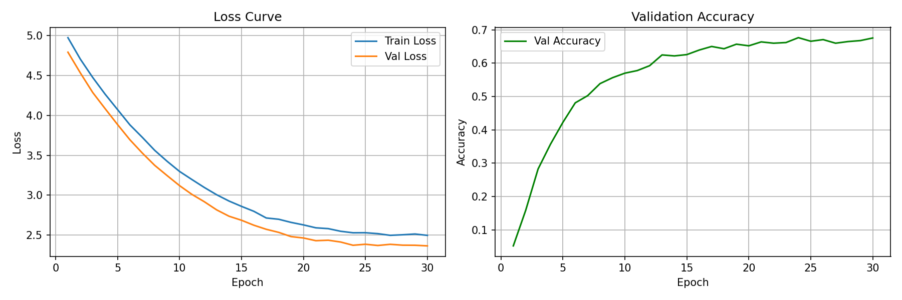
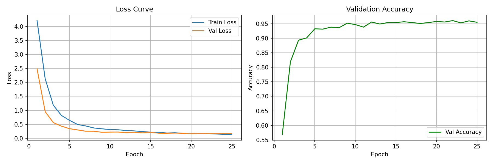
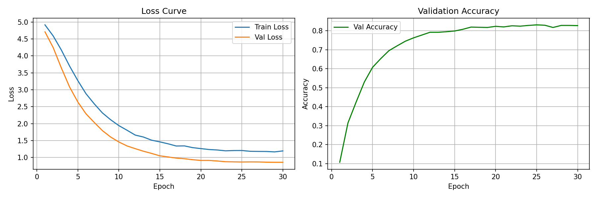
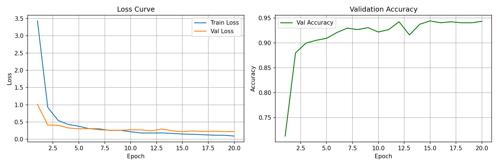
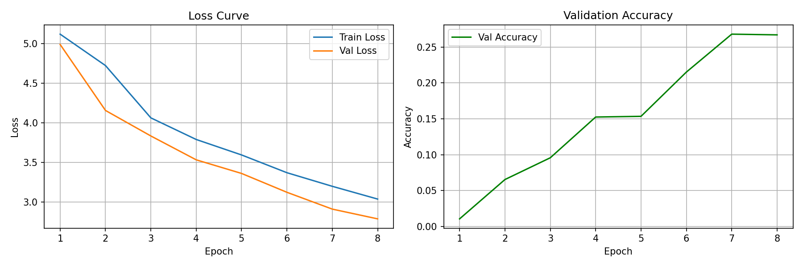
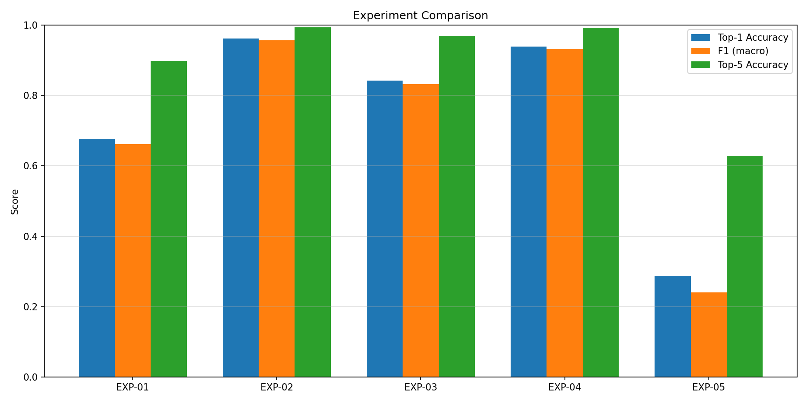

# 🔴 PokéClassifier — Pokemon Image Classifier with Transfer Learning

> 포켓몬 이미지를 입력하면 어떤 포켓몬인지 분류하는 Transfer Learning 기반 이미지 분류기

---

## 🖥️ Demo


- 5가지 모델 탭 전환하며 실시간 비교 가능
- 이미지 업로드 → 분류 시작 → Top-5 결과 확인

```bash
streamlit run app.py
# → http://localhost:8501
```

---

## 📦 Dataset

- **출처**: [7,000 Labeled Pokemon — Kaggle](https://www.kaggle.com/datasets/lantian773030/pokemonclassification)
- **클래스 수**: 150종
- **분할**: Train 70% / Val 15% / Test 15% (stratified)

---

## 🧪 실험 설정 및 결과

**실험 목표**: Backbone 모델, Fine-tuning 범위, Pretrained weight 유무에 따른 성능 비교

| 실험 | Backbone | Fine-tuning 범위 | Pretrained | Test Acc | Precision | Recall | F1 | Top-5 Acc |
|------|----------|-----------------|------------|----------|-----------|--------|----|-----------|
| EXP-01 | ResNet-50 | Head only | ✅ | 67.7% | 72.7% | 66.4% | 66.1% | 89.8% |
| EXP-02 | ResNet-50 | Full | ✅ | **96.2%** | **96.5%** | **95.7%** | **95.7%** | **99.4%** |
| EXP-03 | EfficientNet-B0 | Last 2 blocks | ✅ | 84.3% | 86.4% | 83.3% | 83.2% | 97.0% |
| EXP-04 | ViT-B/16 | Full | ✅ | 93.8% | 94.0% | 93.3% | 93.1% | 99.2% |
| EXP-05 | ResNet-50 | Full | ❌ | 28.7% | 29.0% | 27.3% | 24.0% | 62.8% |

### 핵심 인사이트

- **Pretrained weight 유무가 가장 큰 영향**: EXP-02(96.2%) vs EXP-05(28.7%) — 67.5%p 차이
- **Fine-tuning 범위도 중요**: EXP-01(head only, 67.7%) vs EXP-02(full, 96.2%) — 28.5%p 차이
- **ResNet-50 Full FT가 최고 성능**: ViT(93.8%)보다 학습 시간은 짧으면서 성능은 더 높음
- **EfficientNet-B0**: 일부만 fine-tuning해도 84.3%로 준수한 성능

---

## 📈 Learning Curves

| EXP-01 (ResNet Head only) | EXP-02 (ResNet Full FT) |
|:-------------------------:|:-----------------------:|
|  |  |

| EXP-03 (EfficientNet) | EXP-04 (ViT-B/16) |
|:---------------------:|:-----------------:|
|  |  |

| EXP-05 (ResNet Scratch) | 실험 비교 차트 |
|:-----------------------:|:-------------:|
|  |  |

---

## 🚀 실행 방법

### 1. 환경 설치

```bash
pip install -r requirements.txt
```

### 2. 데이터셋 준비

```bash
# Kaggle에서 다운로드 후 압축 해제
unzip pokemonclassification.zip -d data/
```

### 3. 전체 실험 실행

```bash
python src/experiment.py --data_dir "data/PokemonData"
# 결과는 results/ 폴더에 자동 저장
```

### 4. 데모 GUI 실행

```bash
streamlit run app.py
# → http://localhost:8501
```

---

## 🗂️ 프로젝트 구조

```
pokemon-transfer-learning-classifier/
├── data/
│   └── PokemonData/          # Kaggle 데이터셋
├── models/                   # 학습된 가중치 (.pth)
├── results/
│   ├── EXP-01/ ~ EXP-05/    # 실험별 metrics, learning curve
│   └── comparison_chart.png  # 실험 비교 차트
├── src/
│   ├── dataset.py
│   ├── model.py
│   ├── train.py
│   ├── evaluate.py
│   └── experiment.py
├── app.py                    # Streamlit 데모
└── README.md
```

---

## ⚙️ 하이퍼파라미터

| 항목 | 값 |
|------|---|
| Optimizer | AdamW |
| Learning Rate | 1e-4 |
| Scheduler | CosineAnnealingLR |
| Epochs | 30 (early stopping patience=5) |
| Batch Size | 32~64 |
| Image Size | 224 × 224 |

---

## 🛠️ 기술 스택

`Python` `PyTorch` `timm` `Streamlit` `scikit-learn` `Pillow`